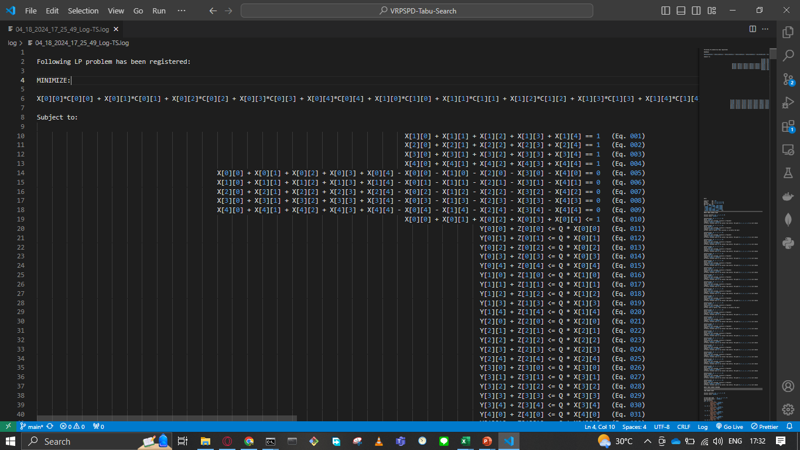
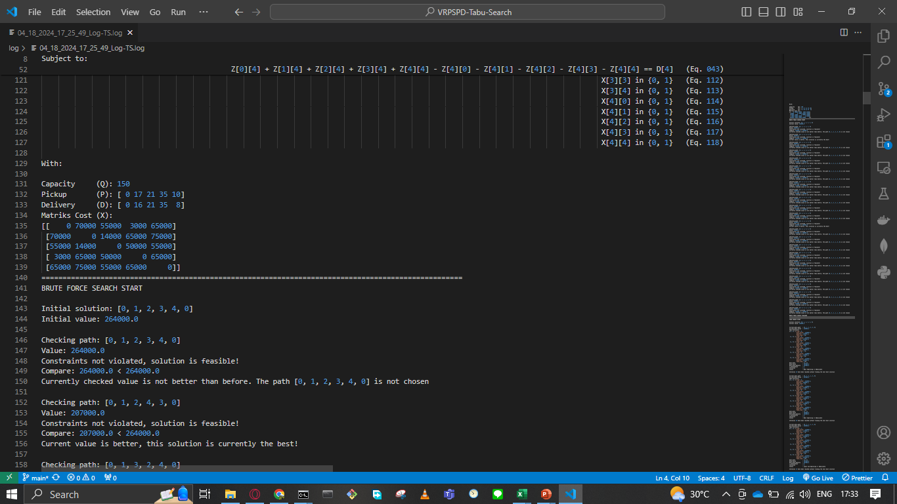
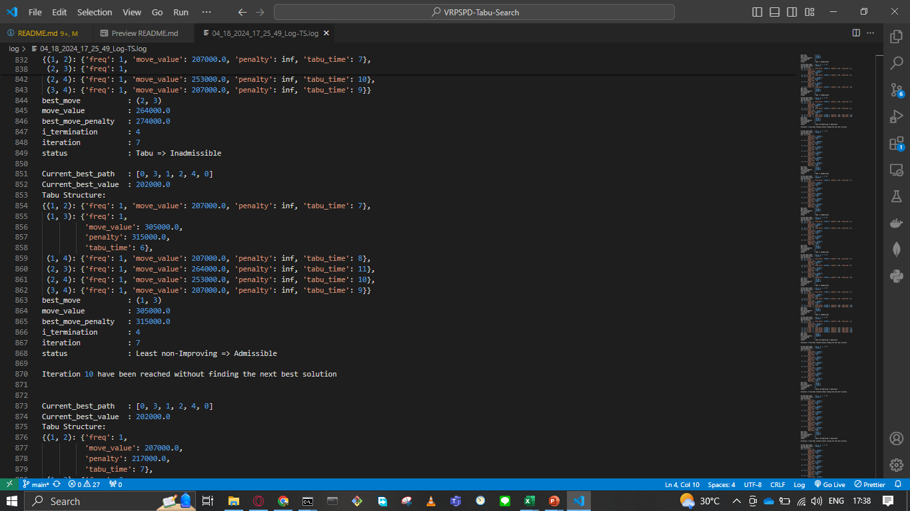
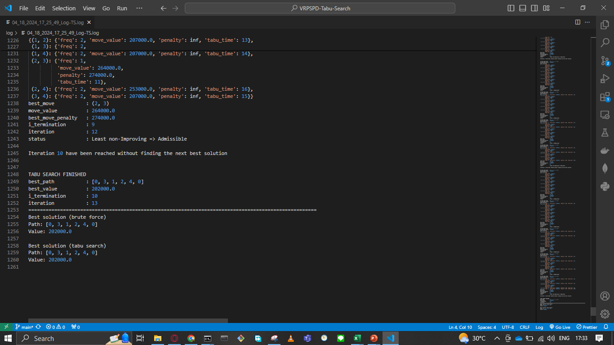
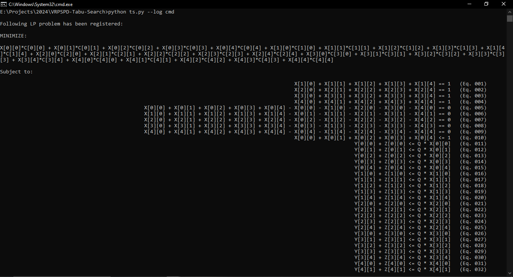
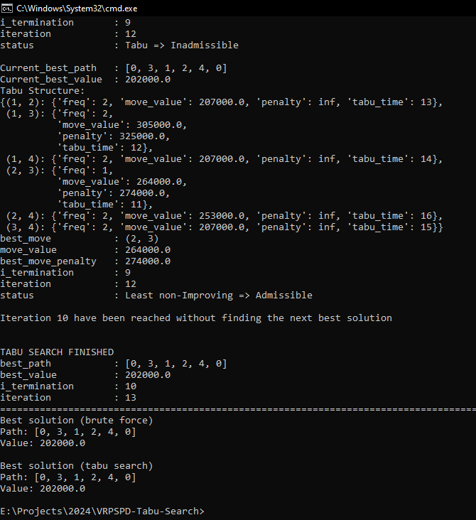

# VRPSPD-Tabu-Search

Implementation of Tabu Search to solve VRPSPD

## How to Run

Assuming you already have `git` installed in your computer and `numpy` package is already installed for python.

1. First clone the repository

```
git clone https://github.com/rinogrego/VRPSPD-Tabu-Search
```

2. Open the project directory
```
cd VRPSPD-Tabu-Search
```

3. Run the program using the sample data
```
python ts.py
```

4. Check inside the `log` folder to see the results

<h3>Register the Problem</h3>

<h3>Start Iteration Process</h3>

<h3>Tabu Search Process</h3>

<h3>Tabu Search Finished</h3>


5. If you want to have the results printed directly inside the terminal, then run
```
python ts.py --log
```
<h3>Results Inside Terminal</h3>

<h3>Results Inside Terminal</h3>
